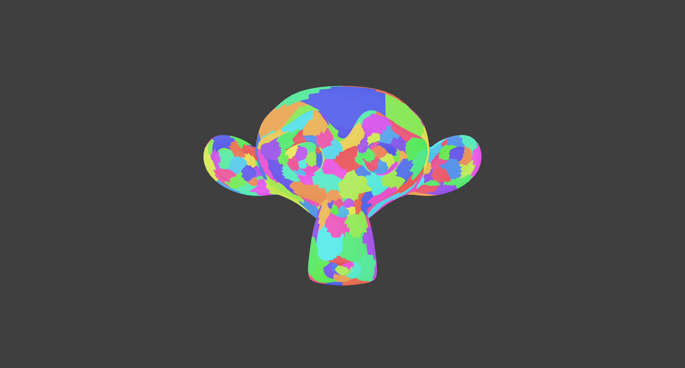
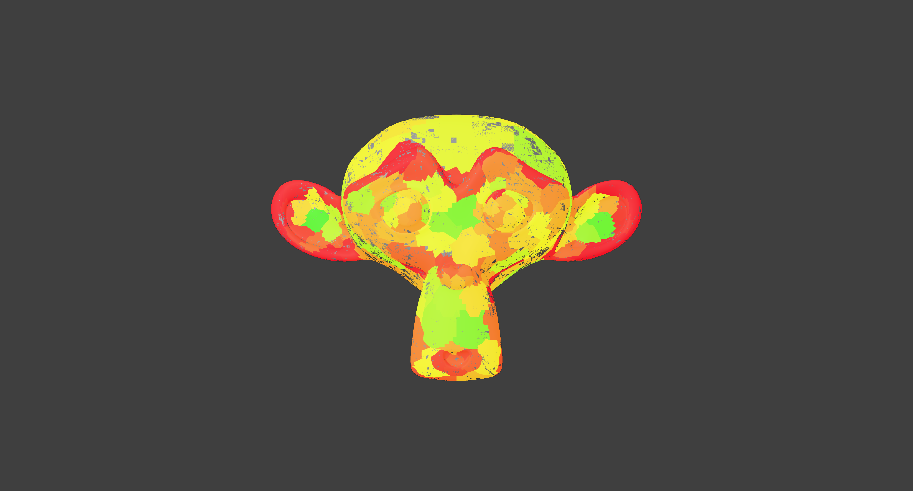
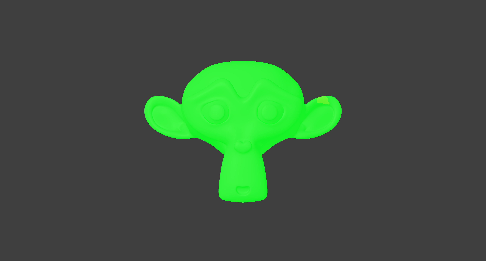
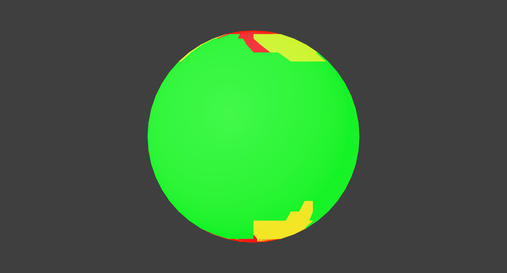
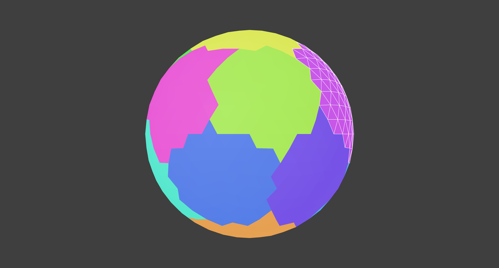
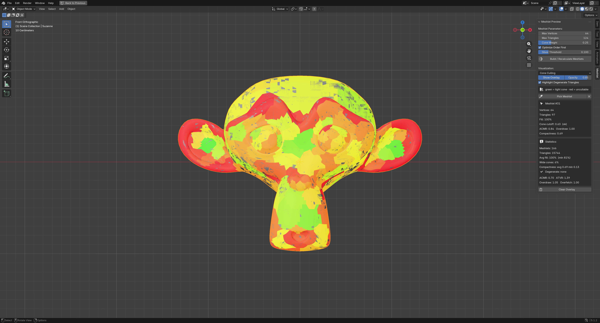

# Meshlet Preview

A Blender extension that splits a mesh into **meshlets** with
[meshoptimizer](https://github.com/zeux/meshoptimizer) and previews them in the
3D viewport, so a modeller can see and fix the things that hurt GPU
mesh-shading / cluster-culling performance.

Built for **Blender 5.1.2** (Python 3.13); the manifest declares
`blender_version_min = 4.2.0`.

|  |  |
|:--:|:--:|
|  |  |
| **Meshlet partition** — one color per cluster | **Cone culling** — red ears are wide cones that can't be cluster-culled |
|  |  |
| **Fill efficiency** — green = meshlets packed near the vertex/triangle caps | **Geometry quality** — red sliver triangles flagged at the UV-sphere poles |
|  |  |
| **Click to select** — the picked meshlet's triangles outlined | **Sidebar panel** — parameters, view modes and per-meshlet stats |

## What it shows

Pick a metric in the **Meshlet** sidebar panel (`N` → *Meshlet*) and the overlay
recolors live. Tune the parameters and press **Build / Recalculate Meshlets** to
re-split after editing the mesh.

| View mode | What it reveals |
|-----------|-----------------|
| **Meshlet Partition** | The actual triangle clusters (one color each). Long/stringy clusters cluster poorly. |
| **Fill Efficiency** | How full each meshlet is vs the vertex/triangle caps. Red = under-filled = wasted GPU warps. |
| **Cone Culling** | Normal-cone tightness. Red = wide/uncullable cone (can't be backface-cluster-culled). |
| **Overdraw** | Per-meshlet overdraw ratio from meshoptimizer's software rasterizer. |
| **Vertex Cache (ACMR)** | Per-meshlet average cache miss ratio (triangle ordering quality). |
| **Geometry Quality** | Red where a meshlet has degenerate/sliver triangles (scale-invariant quality below the *Sliver Threshold*) or is spatially stringy (low compactness). Picking it outlines the offending triangles in red. |

**Highlight Degenerate Triangles** (on by default) outlines *every* degenerate
triangle in red across the whole mesh, in any view mode, without having to pick
a meshlet — so bad faces are visible at a glance. Tune the *Sliver Threshold* to
control how aggressive "degenerate" is.

The panel also reports global statistics: meshlet count, average/min fill,
percentage of wide cones, degenerate-triangle count, average/min compactness,
ACMR, ATVR, overdraw and overfetch.

The overlay is **non-destructive** — it is drawn with the `gpu` module and never
modifies your mesh data. It evaluates modifiers, so the preview matches what
actually gets rendered.

### Inspecting a single meshlet

Press **Pick Meshlet** and click a meshlet in the viewport: it is outlined as a
white wireframe and the panel shows that meshlet's vertex/triangle counts, fill,
cone cutoff, ACMR and overdraw. Click empty space to deselect, `Esc` or
right-click to finish picking (you can still orbit/zoom while picking).

The selection is **x-rayed** — parts of the picked meshlet hidden behind other
meshlets still show as a faint wireframe, so you can see its full extent (e.g.
where a cluster wraps around to the back of the surface).

### Why cone culling matters (the red ears)

A GPU mesh-shading pipeline can reject an *entire meshlet* before rasterizing it
— but only if it can prove **every** triangle in that meshlet faces away from
the camera. To make that test cheap, meshoptimizer summarizes a meshlet's
triangle normals as a **normal cone**: an average **axis** plus a **spread
angle**.

```
   narrow cone (flat patch)          wide cone (curved patch / ear)
        ↑ ↑ ↑                          ↖ ↑ ↗
        | | |   normals ~parallel       ↙   ↘   normals point every which way
        axis                           (no single "away" direction)
```

A meshlet is entirely back-facing only when the camera sits inside its
"anti-cone" — and that anti-cone's half-angle is `90° − (normal-cone
half-angle)`:

- **Narrow cone** (flat region, e.g. a cheek): small normal spread → large
  anti-cone → the cluster is provably back-facing from a wide range of angles →
  culled often. **Green.**
- **Wide cone** (high curvature, e.g. the **ears**): the surface curves through
  a large arc, so the meshlet's normals point in many directions and the
  anti-cone shrinks to nothing. From almost any viewpoint the cluster has some
  triangles facing the camera and some facing away, so it can never be safely
  rejected and is always rasterized. **Red.**

meshoptimizer stores `cone_cutoff = sin(½·spread)` and, once the spread exceeds
~84° (useless for culling), sets the sentinel `cone_cutoff = 1.0`. The **Cone
Culling** view colors by it: ~0 (tight) → green, →1 (wide/sentinel) → red, and
the panel reports the percentage of such wide cones. Practically, red marks
where high curvature forces small, un-cullable clusters — reducing curvature
there, or lowering `max_triangles`/`max_vertices` so meshlets stay flatter,
shrinks the cones and turns red toward green.

## Installation

### From a release (recommended)

1. Download `meshlet_preview-<version>.zip` from the
   [**Releases**](../../releases) page. The zip bundles the native library for
   macOS (Apple Silicon + Intel), Windows x64 and Linux x64 — Blender picks the
   one for your platform automatically.
2. In Blender: **Edit → Preferences → Add-ons** (Blender 5.x: the *Get
   Extensions* / *Add-ons* tab) → the **▾** menu (top-right) → **Install from
   Disk…** → pick the zip.
   - Or simply **drag-and-drop the zip into the Blender window**.
3. Enable **Meshlet Preview** if it isn't already, then open the 3D viewport
   sidebar (`N`) and switch to the **Meshlet** tab.

Requires Blender 4.2 or newer (developed against 5.1.2). When prompted, allow
the bundled Python wheel to be installed — that is the meshoptimizer library.

### From source

```sh
python3 native/build_wheel.py        # compile the native wheel for this OS
python3 native/package_extension.py  # -> dist/meshlet_preview-<version>.zip
```

then install `dist/meshlet_preview-<version>.zip` as above. The source build only
contains the wheel for your current platform.

## Releases (CI)

Pushing a `v*` tag (e.g. `git tag v0.1.0 && git push origin v0.1.0`) triggers
`.github/workflows/release.yml`, which builds the native wheel on macOS arm64,
macOS x64, Windows x64 and Linux x64 runners, runs `native/package_extension.py`
to assemble a single multi-platform zip, and publishes it as a GitHub release.

Running the workflow manually (*Actions → Build & Release → Run workflow*) also
publishes a release: the tag defaults to the manifest version (`v0.1.0`), or you
can set a custom **tag** input. The tag is created at the chosen commit if it
doesn't already exist; re-running with the same tag updates that release.

## How it is built

meshoptimizer's public PyPI package does **not** expose the meshlet builder, so
this project vendors the meshoptimizer MIT C source (`native/meshoptimizer/`)
plus a thin C ABI shim (`native/mp_shim.cpp`) that runs the whole pipeline in one
call. It is compiled to a shared library and called from Python via `ctypes`
(`meshlet_preview/meshopt.py`), so it is independent of Blender's Python ABI.

The library is delivered as a platform **wheel** bundled by the extension —
the supported way to ship native code to
[extensions.blender.org](https://extensions.blender.org/).

### Build the native wheel

```sh
python3 native/build_wheel.py
```

This compiles the shared library for the current OS/arch and writes a wheel into
`meshlet_preview/wheels/`. Run it on each platform you want to support, collect
the wheels into `meshlet_preview/wheels/`, then `native/package_extension.py`
rewrites the manifest's `wheels`/`platforms` lists to match and builds the zip.
CI does exactly this across all platforms (see *Releases* above).

### Build / install the extension

```sh
# Build the installable .zip
blender --command extension build --source-dir meshlet_preview --output-dir dist

# Or install straight into Blender
blender --command extension install-file --repo user_default --enable \
    dist/meshlet_preview-0.1.0.zip
```

To remove it again: *Edit → Preferences → Get Extensions → Meshlet Preview →
Remove*, or `blender --command extension remove ...`.

## Tests

A `unittest` suite under `tests/` with discovery and per-case reporting:

- `tests/test_native.py` — unit tests for the native shim + ctypes wrapper
  (no Blender).
- `tests/test_addon.py` — integration tests inside Blender (operator, view-mode
  colormaps, meshlet picking incl. the n-gon branch). Auto-skipped when `bpy`
  is unavailable.
- `tests/test_installed.py` — system test of the installed extension (native
  lib loaded from the bundled wheel). Skipped unless installed.

```sh
# Native unit tests (no Blender). CI runs this on every platform.
python3 -m unittest discover -s tests -p "test_*.py" -v

# Full suite inside Blender; exits non-zero on failure.
blender --background --python tests/run_blender.py
```

Visual harness (manual GPU check; not assertions):

```sh
blender --background --python tests/make_scene.py
blender /tmp/ml.blend --python tests/screenshot.py -- /tmp/ms_CONE.png CONE
```

## Layout

```
meshlet_preview/            the extension (uploadable to extensions.blender.org)
  blender_manifest.toml
  __init__.py               registration
  props.py                  parameters + view-mode enum
  ops.py                    build / clear operators
  ui.py                     N-panel
  draw.py                   result cache, colormaps, GPU overlay
  meshopt.py                ctypes binding to the native shim
  wheels/                   bundled native wheel(s)
native/
  meshoptimizer/            vendored MIT source (v0.22)
  mp_shim.cpp               C ABI shim over meshoptimizer
  build_wheel.py            compiles the lib and packages the wheel
tests/
```

## License

MIT — see [`LICENSE`](LICENSE). The bundled meshoptimizer source is also MIT
(see [`native/meshoptimizer/LICENSE.meshoptimizer.txt`](native/meshoptimizer/LICENSE.meshoptimizer.txt)).
